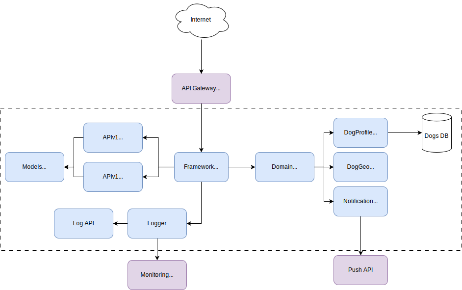

## WoofConnect
WoofConnect - это социальная сеть для собак и их хозяев.
Улучшает социальную жизнь своих питомцев: добавляйтесь в друзья, планируйте совместные прогулки, и избегайте врагов!

## Для кого это приложение
Приложение поможет тем хозяевам, которые хотят использовать время прогулки максимально эфективно;
новичкам в собаководстве познакомиться с более опытными хозяевами; 
поможет тем и другим отслеживать взаимодействия собак и следить за динамикой их отношений;
энтузиасты и профессионалы смогут организовать локальное мероприятие или предложить свои услуги.

## MVP - основные функции
- Профиль пса
  Содержит различную информацию о собаке, включая фотографии
- Сетевые контакты
  Дает возможность добавлять других собак в списки "друзей" или "врагов", следить за историей взаимодействий и настраивать уведомления
- Интерактивная карта
  Друзья и враги отслеживаются в реальном времени, если они тоже гуляют
- Уведомления если друг собирается или уже пошёл на прогулку, предупреждение, если недалеко обнаружен враг

## Интерфейс пользователя
[Набросок на Yandex disk](https://disk.yandex.ru/d/Qp1I2ii5PnkzYw)

## Основные сущности

1. DogProfile (Профиль собаки):
  - id: ULong — уникальный идентификатор профиля.
  - name: String — имя собаки.
  - breed: Enum — порода.
  - age: Int — возраст.
  - weight: Float — вес.
  - temperament: String — характер.
  - vaccinations: List<Vaccine> — список прививок.
  - description: String — короткое описание.
  - photoUrl: String — URL фотографии.

2. UserProfile (Профиль пользователя):
  - id: ULong — уникальный идентификатор пользователя.
  - name: String — имя пользователя.
  - dogProfiles: List<DogProfile> — список собак, принадлежащих пользователю.

3. FriendshipStatus (Статус дружбы):
  - dogId1: ULong — идентификатор первой собаки.
  - dogId2: ULong — идентификатор второй собаки.
  - status: FriendshipStatusType — статус отношений ("FRIEND", "ENEMY", "NEUTRAL").

4. Location (Локация):
  - latitude: Double — широта.
  - longitude: Double — долгота.
  - parkName: String — название парка или места (если применимо).

5. Notification (Уведомление):
  - id: ULong — уникальный идентификатор уведомления.
  - message: String — текст уведомления.
  - type: NotificationType — тип уведомления ("FRIEND_NEARBY", "ENEMY_NEARBY").
  - timestamp: Long — время отправки уведомления.

## Основные операции

1. **Создать собаку у пользователя**
   ```kotlin
   fun createDogProfile(userId: ULong, name: String, breed: Breed, age: Int, weight: Float, temperament: String, vaccinations: List<Vaccine>, description: String, photoUrl: String): DogProfile
2. **Обновить собаку**
   ```kotlin
   fun updateDogProfile(dogId: ULong, name: String?, breed: Breed?, age: Int?, weight: Float?, temperament: String?, vaccinations: List<Vaccine>?, description: String?, photoUrl: String?): DogProfile
   ```
3. **Найти собаку по ID**
   ```kotlin
   fun getDogProfile(dogId: ULong): DogProfile?
   ```
4. **Удалить собаку**
   ```kotlin
   fun deleteDogProfile(dogId: ULong): Boolean
   ```
5. **Искать собак по критериям**
   ```kotlin
   fun searchDogs(breed: Breed?, ageRange: IntRange?, weightRange: FloatRange?, temperament: String?): List<DogProfile>
   ```
6. **Создать пользователя**
   ```kotlin
   fun createUserProfile(name: String): UserProfile
   ```
7. **Получить пользователя**
   ```kotlin
   fun getUserProfile(userId: ULong): UserProfile?
   ```

8. **Установить отношения между собаками**  
   ```kotlin
   fun setFriendshipStatus(dogId1: ULong, dogId2: ULong, status: FriendshipStatusType): FriendshipStatus
   ```
9. **Получить отношения между собаками**  
   ```kotlin
   fun getFriendshipStatus(dogId1: ULong, dogId2: ULong): FriendshipStatus
   ```
10. **Получить друзей собаки**  
   ```kotlin
   fun getDogFriends(dogId: ULong): List<DogProfile>
   ```
11. **Получить врагов собаки**  
   ```kotlin
   fun getDogEnemies(dogId: ULong): List<DogProfile>
   ```
12. **Обновить местоположение собаки**  
   ```kotlin
   fun updateDogLocation(dogId: ULong, location: Location): Boolean
   ```
13. **Получить собак в радиусе от собаки**  
   ```kotlin
   fun getNearbyDogs(dogId: ULong, radius: Double): List<DogProfile>
   ```
14. **Послать нотификацию владельцу собаки**  
   ```kotlin
   fun sendNotification(dogId: ULong, message: String, type: NotificationType): Notification
   ```
---
## Архитектура


